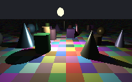

# Raytracer

A browser-based software raytracer written in TypeScript. Renders a low-resolution canvas scene with per-pixel ray casting, diffuse shading, and crisp pixel scaling.

**Live demo:** [alexanderjbuck.github.io/raytracer](https://alexanderjbuck.github.io/raytracer/)



## Local development

Requires [Node.js](https://nodejs.org/) 20+.

```bash
npm install
npm run dev
```

Open [http://localhost:5173](http://localhost:5173). Vite provides hot reload as you edit source files.

### Other commands

| Command | Description |
|---|---|
| `npm run build` | Type-check and emit a production build to `dist/` |
| `npm run preview` | Serve the production build locally (uses `/raytracer/` base path) |
| `npm test` | Run unit tests for vector math and ray-sphere intersection |

## Project structure

```
src/
├── main.ts                 # Entry point
├── app/RayTracerApp.ts     # Animation loop and app wiring
├── scene/                  # Scene types and default scene data
├── math/vec3.ts            # Pure vector math
├── raytrace/               # Intersection and shading (testable)
├── renderer/               # Canvas, pixel buffer, draw calls
└── styles/raytracer.css    # Page and canvas presentation
```

**Separation of concerns:** `math/` and `raytrace/` have no DOM dependencies and are covered by unit tests. `renderer/` owns canvas setup and pixel writes. `app/` ties the render loop together.

## Deployment

Pushes to `main` trigger a GitHub Actions workflow (`.github/workflows/deploy.yml`) that builds with Vite and publishes `dist/` to GitHub Pages.

If the live site returns 404, enable deployment once in the repo:

**Settings → Pages → Build and deployment → Source: GitHub Actions**

The app is built with `base: '/raytracer/'` so asset paths resolve correctly at `https://alexanderjbuck.github.io/raytracer/`.